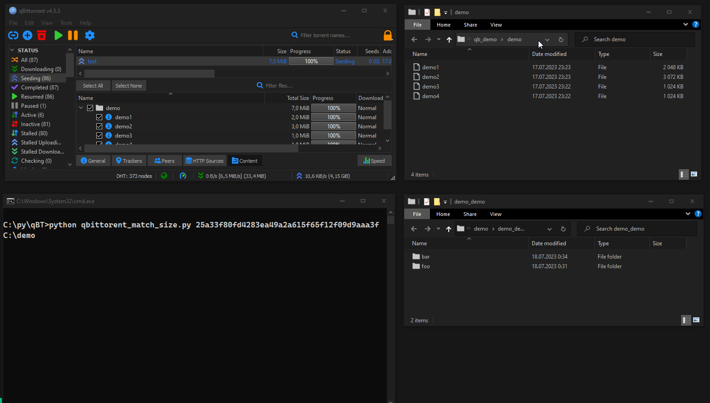

# qBittorrent File Matcher

This script helps match torrents in qBittorrent with their corresponding files on the disk, streamlining file organization and preventing duplication.

You've renamed downloaded files, or changed folder structure and now qBittorrent is unable to find them? Or you want to seed a torrent to contribute to the community, but the torrent's files have different names compared to the files on your disk? By running the script you can easily rename the files within qBittorrent to match the files on your disk.

## Demo

## Changelog as of 21.07.23

- Changes in Default Behavior:
  - In the first version of the script, the default search directory was the download directory of the torrent itself. Now torrent's content directory is the default. This can be altered with `-sd` flag.
- New flags to set search directory, force matched files share an extension, change default search directory.
- Interactive config setup.
- Code clean up and optimization.

## Quirks and Features

* No modification of any files on your disk.
* Search for matches is done by size.
* Matching is done by renaming files in qBittorrent.
* Script scans **ALL** files in the search directory **AND IT'S SUB-DIRECTORIES**, this is done to prevent matching wrong files in a case where you have multiple files of the same size on your disk. This way we will not grab the first one we find, and ignore the rest, but user will be presented with a choice.
* Default search directory is torrent's content directory. You can override it by passing a specific search path in an argument `-s`, or passing `-sd` to force search in the download directory. Script will also search download directory if content directory no longer exists.
* In case of finding multiple file matches, user will be asked to choose a match from a list.
* Set download directory, if files are no longer where qBit downloaded them.
* Set seach directory to search in, useful if you renamed content directory, or download directory contains too many files.
* User will be asked for Web UI credentials if config file is not found.
* Dry run to preview any changes done by the script.

#### FYI: What are the 'download' and 'content' directories?

Download directory is the directory qBittorrent downloads the torrent to.
Content directory is the directory **in** the torrent, if the torrent is not a single file.

## How to Run?

You can run the script from the command line using the following command:

#### ``python qbittorrent_file_matcher.py <torrent_hash> [optional arguments]``

- `<torrent_hash>`: The hash of the torrent to match. (Right click a torrent in qBittorrent, Copy - info hash v1)
- `-s`, `-spath:` Specifies search path. Must be a subpath of the download path. Default is torrent's content directory.
- `-d`, `-dpath`: Sets new download path for the torrent. Does not actually move the files.
- `-sd`: Forces search in torrent's download directory. Default is torrent's content directory. Ignored if passed along with `-s`.
- `-e`, `-ext`: Forces matched files to share an extension.
- `-dry`: Performs a dry run without modifying anything.

## Notes

* Tested on Windows 10

## Setup

### Install dependencies

- [colorama](https://pypi.org/project/colorama/)
- [InquirerPy](https://pypi.org/project/inquirerpy/)
- [qbittorrent-api](https://pypi.org/project/qbittorrent-api/)

#### ``pip install colorama inquirerpy qbittorrent-api``

### Enable Web UI

In qBittorrent - Tools -> Options -> Web UI -> Top checkmark

### Run the Script!
